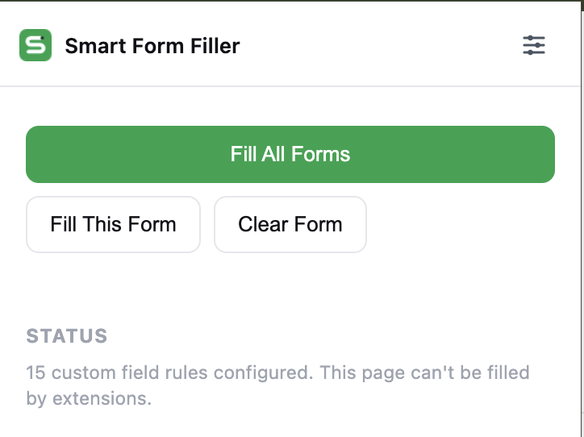
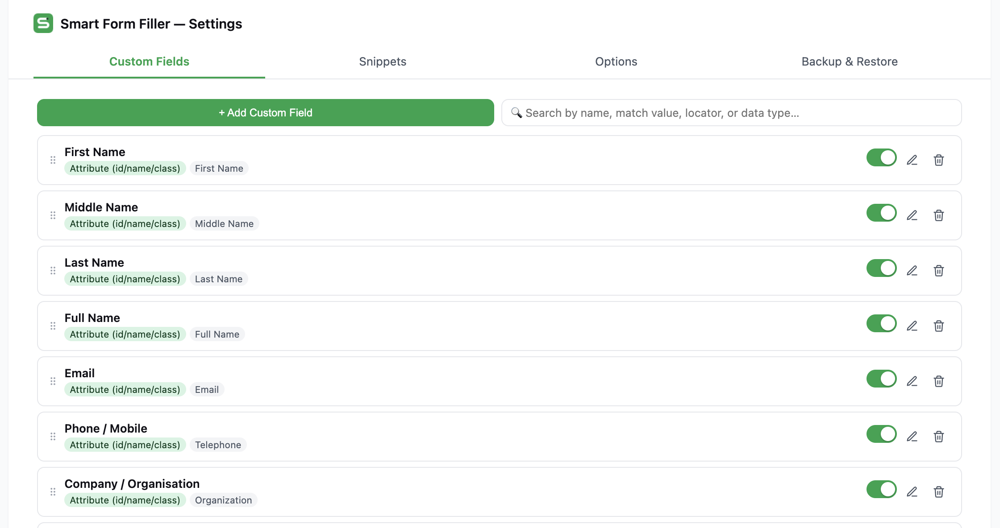
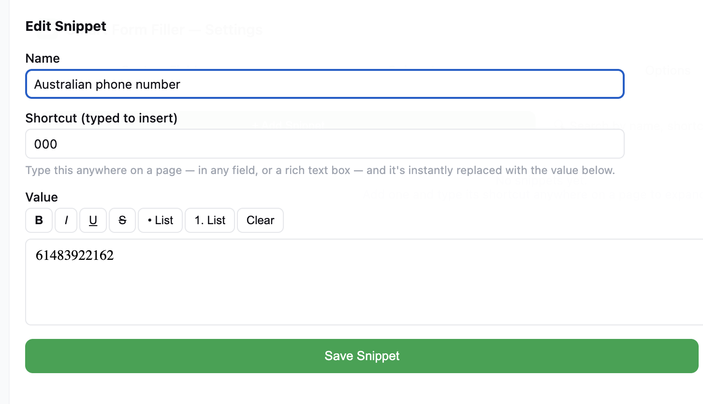

<p align="center">
  
</p>

<h1 align="center">Smart Form Filler</h1>

<p align="center" style="font-size:18px;">
  A Chrome extension (Manifest V3) for two everyday jobs:
</p>

<p align="center" style="font-size:18px;">
  🧪 generating realistic <strong>fake data</strong> for software development and testing<br/>
  📝 auto-filling your own <strong>repetitive personal details</strong> into everyday forms so you never have to retype them
</p>

<p align="center">
  Matches fields by <strong>label, placeholder, CSS, XPath, ARIA role, test-id, or visible text</strong> — not just by label.
</p>

> ⚠️ **Not on the Chrome Web Store.** This is currently a local/unpacked extension only — see **Getting Started** below for how to load it in Chrome.

---

## 📸 Screenshots

<p align="center">
  <br/>
  <sub><b>Popup</b> — Fill All Forms, Fill This Form, Clear Form</sub>
</p>

<p align="center">
  <br/>
  <sub><b>Custom Fields</b> — default presets, ready out of the box</sub>
</p>

<p align="center">
  <br/>
  <sub><b>Snippets</b> — rich-text shortcut editor</sub>
</p>

---

## ✨ Features

- 🖱️ **Fill All Forms** — one click fills every field on the page (or just the current form, or a single right-clicked field), across all frames/iframes.
- 🎯 **Custom Fields** — rules that match a page field by Label, Placeholder, CSS selector, XPath, ARIA Role + accessible name, Test ID, visible Text, or a classic id/name/class attribute regex, then fill it with a chosen data type (names, email, phone, address, dates, randomized lists, regex-generated strings, and more). Ships with default presets — First/Last Name, Email, Phone, Address, etc. — that recognise common fields automatically.
- ⚡ **Snippets** — built-in text expansion. Give a snippet a shortcut (e.g. `/mob`) and a rich-text value; typing the shortcut anywhere on a page (any input, textarea, or rich text editor) instantly replaces it with that value, formatting included.
- 🧩 **Framework-aware filling** — writes values through the native property setter so modern JavaScript-framework-controlled inputs pick up the change, instead of a passive `.value` assignment that gets silently reverted on the next render.
- 📋 **Custom dropdown support** — for widgets with no native `<select>` (a text input paired with a floating options popup), it opens the dropdown and clicks a matching option, the same way a real user would.
- 🔔 **Fill feedback** — an optional brief highlight on each filled field and a soft synthesized confirmation sound, both independently toggleable.
- 💾 **Backup & Restore** — export/import all settings, custom fields, and snippets as a single JSON file.
- 🔒 **100% local** — no network requests anywhere in the codebase; nothing is ever sent off the device.

---

## 🚀 Getting Started (Local Install)

Since this isn't published to the Chrome Web Store, you load it directly from the folder:

1. **Get the folder onto your computer.** If someone sent you this project as a ZIP, unzip it first. If you already have it locally, just note the folder path.
2. Open **`chrome://extensions`** in Chrome.
3. Turn on **Developer mode** — toggle in the top-right corner.
4. Click **Load unpacked**.
5. Select this project's folder (the one containing `manifest.json`).
6. The extension icon appears in your toolbar — click the puzzle-piece icon and **pin it** for quick access.

**Using it day to day:**

- Click the toolbar icon for quick actions — **Fill All Forms**, **Fill This Form**, or **Clear Form**.
- Click the ⚙️ settings icon inside that popup to open the full settings page: **Custom Fields**, **Snippets**, **Options**, and **Backup & Restore**.
- Right-click any field on a page for single-field actions (Fill this field / Fill this form / Fill all).

**Testing on local files:** for `file://` pages (e.g. `test-page/test-form.html`), enable **"Allow access to file URLs"** on the extension's details page in `chrome://extensions` — Chrome blocks content scripts on local files by default.

**Keeping it up to date:** after pulling/copying in any code changes, go back to `chrome://extensions` and click the ↻ **reload** icon on the extension card — then refresh any already-open tabs you're testing on.

---

## 🔑 Permissions, explained

- **`storage`** — saves your settings, custom fields, and snippets locally (`chrome.storage.local`). Never synced off-device.
- **`contextMenus`** — adds the right-click menu items: Fill all inputs / Fill this form / Fill this field.
- **`webNavigation`** — enumerates a tab's frames so "Fill All Forms" can reach fields inside iframes.
- **`activeTab`** — reads the active tab's URL in the popup, just to disable Fill on pages that can't be scripted (like `chrome://` pages).
- **Content script on `<all_urls>`** — the extension's core purpose is filling and snippet-expanding on *any* site, so it needs to run everywhere. It never phones home — everything it reads stays in the page or in local storage.

No `host_permissions` for network access, no remote code, no analytics.

---

## 🛡️ Privacy & Security

- **No network calls.** Every data type (names, emails, phone numbers, addresses, etc.) is generated locally from small built-in word lists — the extension never talks to a server.
- **No remote code.** No `eval`, no dynamically fetched scripts; everything ships in the package (MV3's default extension-page CSP blocks this outright anyway).
- **User-controlled text is escaped before rendering.** Custom field names, snippet names/shortcuts, and search queries are HTML-escaped before being inserted into the settings UI.
- **Snippet rich text is sanitized, not trusted, at the point of use.** A snippet's formatted value passes through a tag whitelist (bold/italic/underline/strike/lists only, all attributes stripped) both when redisplaying it in the editor and — critically — right before it's ever inserted into a page you're typing on. Even a tampered or maliciously-crafted imported backup can't smuggle a `<script>` or an `onerror`/`onclick` handler onto a site you visit through a snippet.
- **Local storage only.** Settings, custom fields, and snippets live in `chrome.storage.local` — never `sync` — so your configuration never leaves the device.

*(If this is ever published to the Chrome Web Store, its privacy practices disclosure should state: no data collected, no data sold or shared, local-only storage.)*

---

## 📁 Project structure

```
manifest.json
background.js                 # service worker: context menus, commands, cross-frame fill relay
content/                       # content scripts (classic scripts, share a window.FF namespace)
  randexp-lite.js              # dependency-free regex -> string generator
  data-generator.js            # fake-data generators + identity cache (consistent name/email/etc. per fill pass)
  locator-engine.js            # label/placeholder/css/xpath/role/testId/text/attribute matching
  field-scanner.js             # enumerates fillable elements on the page
  state-cache.js               # in-memory settings/customFields/snippets cache, kept fresh via storage.onChanged
  feedback.js                  # fill-flash animation + synthesized success sound
  text-expander.js             # snippet shortcut detection + expansion (plain + rich text)
  content.js                   # message handler: fillAll/fillForm/fillField/clear, combobox handling
popup/                          # toolbar popup: quick Fill/Clear actions
options/                        # full-page settings (Custom Fields, Snippets, Options, Backup & Restore)
views/                          # shared UI view modules used by the options page
shared/                         # constants, storage helpers, HTML escaping/sanitizing, toast, CSS
icons/, test-page/
```

No build step — it's plain HTML/CSS/JS. Edit and reload the unpacked extension to iterate.

---

## 📄 License

Not yet chosen. Add a `LICENSE` file before open-sourcing or publishing.
